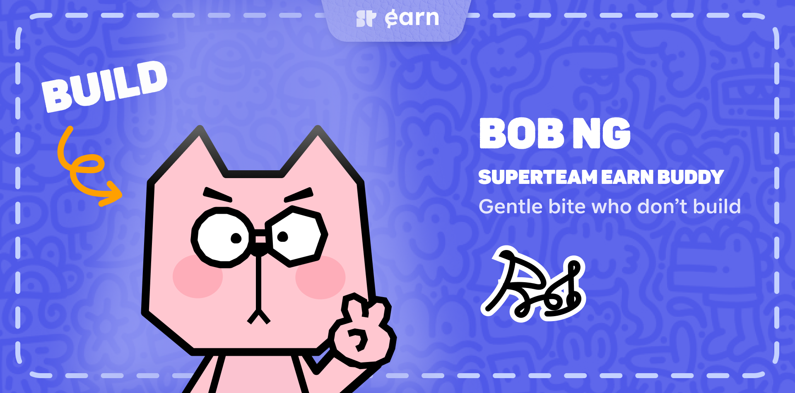

# Bob Buddy 

Bob is applying to be a Superteam Earn Intern. 
He will honk to all the Superteam Builders about new listings on Superteam Earn. 

Encouraging and reminding builders not just to earn, but also to keep building consistently, always seeking new challenges.



Bob is under training program, he will be ready to onboard on couple of days.

<div align="center">
<a href="https://youtube.com/shorts/rKS3iPoUWqI" target="_blank" style="text-decoration: underline;">[Video Preview]</a>
<a href="https://t.me/SuperteamEarnBot" target="_blank" style="text-decoration: underline;">[Telegram Bot]</a>

</div>

## Features
- Onboarding User with Bob (character with joyful personality)
- Short and concise skill filters
- Not spamming, notify user one by one listing available
- Remind user about the listing deadline

## Development Setup

### Prerequisites

- Node.js 20+
- pnpm
- Telegram (Father Bot)
- Ngrok (for local development)
- SQLlite (for local development)

### Setup

1. Clone the repository
```bash
git clone https://github.com/sonhavietnamese/bob-buddy.git
cd bob-buddy
```

2. Install dependencies
```bash
pnpm install
```

3. Setup database (for local development)
> For local development, you can use SQLlite database.
> For production, you can use MySQL database.
> You can modify the database connection in `src/config.ts`

```bash
pnpm db:generate
pnpm db:push
```

4. Setup environment variables
```bash
cp .env.example .env
```
- `TELEGRAM_BOT_TOKEN` is the token of your bot, follow [this guide](https://core.telegram.org/bots/tutorial#getting-ready) to get one
- `NGROK_AUTHTOKEN` is the auth token of your ngrok account, you can get it from [ngrok](https://dashboard.ngrok.com/). This is used only for local development.
- `NODE_ENV` is the environment of your bot, you can set it to `development` or `production`.

5. Run the bot
```bash
pnpm start
```

6. Additional configuration

Bob's behavior is controlled by various timing configurations that differ between development and production environments, you can modify them in [src/config.ts](src/config.ts).

Below is the most important ones:

- Cronjobs
  - `LISTINGS_SCAN`: Scans Superteam Earn for new bounties and projects
  - `NOTIFICATIONS`: Processes skill matching and sends notifications/reminders

- Reminders
  - `DEFAULT_INTERVAL_HOURS`: When user clicks "Remind me" button
  - `RECENT_NOTIFICATION_CUTOFF_MS`: Prevents duplicate notifications

- Message Queue & Rate Limiting
  - `RATE_LIMIT_PER_SECOND`: Telegram API rate limit
  - `BATCH_SIZE`: Batch size for sending messages
  - `RETRY_DELAY_MS`: Retry delay
  - `BATCH_PROCESSING_DELAY_MS`: Delay between batches

- API & Network
  - `BATCH_DELAY_MS`: Delay between API batches when fetching listing details
  - `LISTING_BATCH_SIZE`: Listings per batch from Superteam API
 